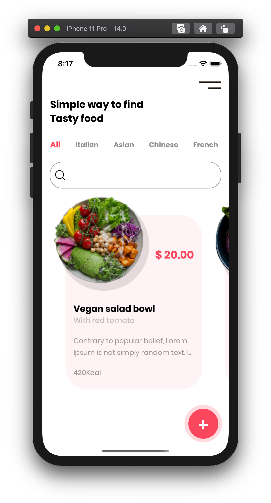
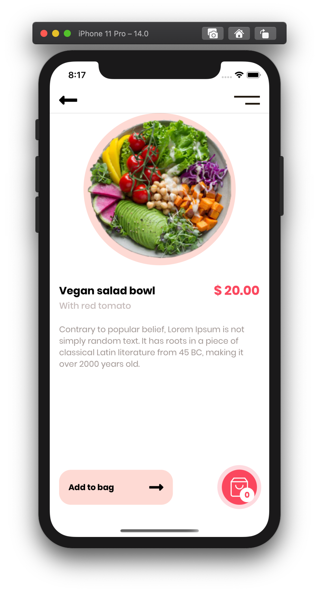

# [PoC] UI FoodApp

Only a SwiftUI design example. The idea is to show how to do a SwiftUI design quickly.

### Fonts
- Poppins [link](https://fonts.google.com/specimen/Poppins)

### UI Credit
- Design by: Saini UIUX Designer [link](https://www.uplabs.com/posts/happy-meals-food-delivery-app)

